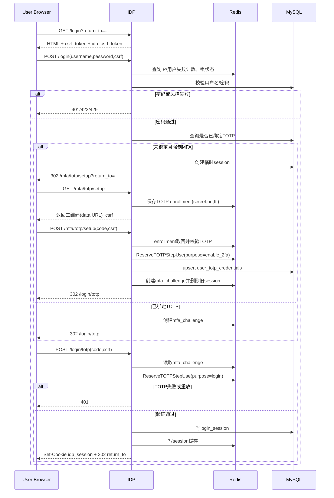
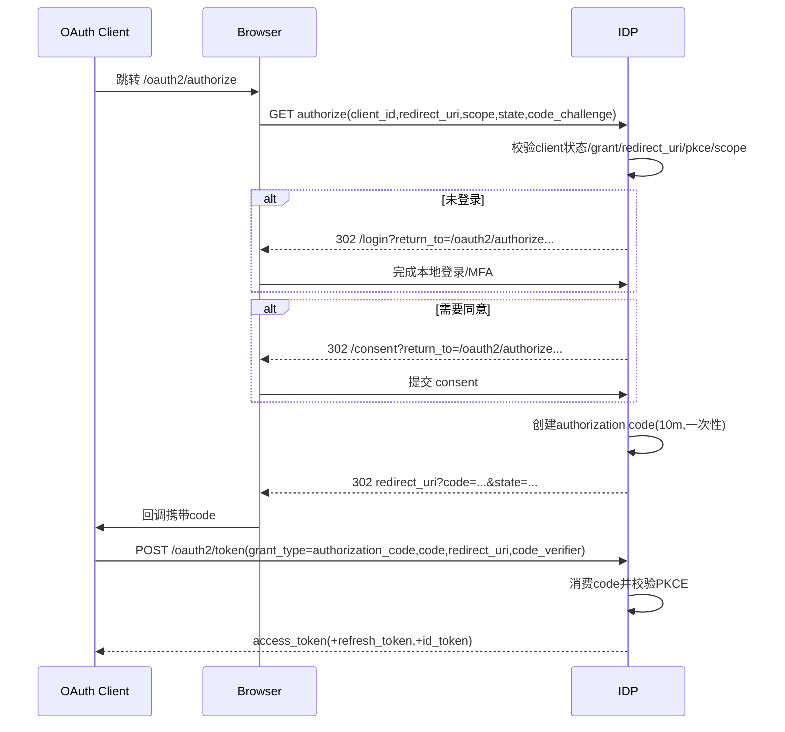
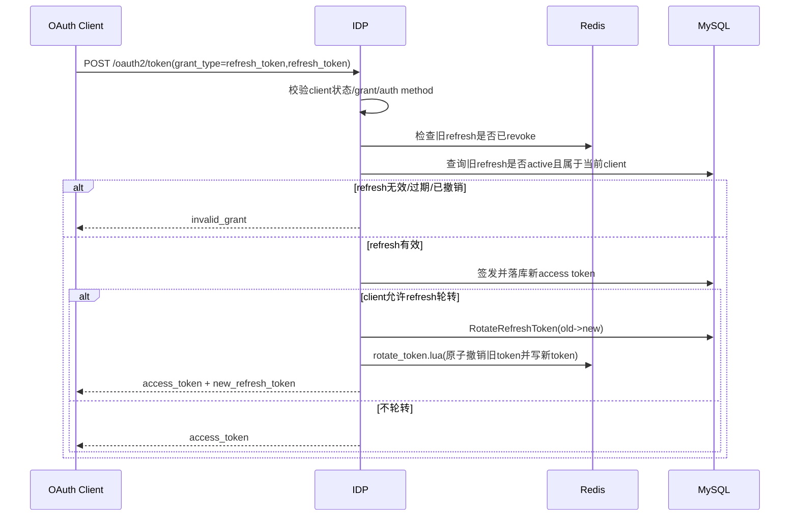
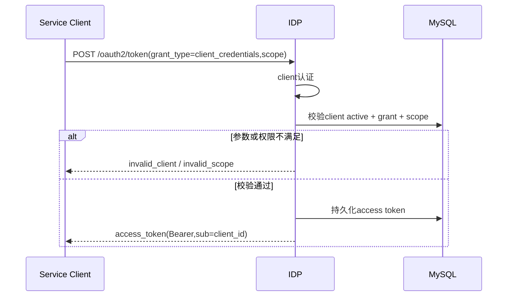
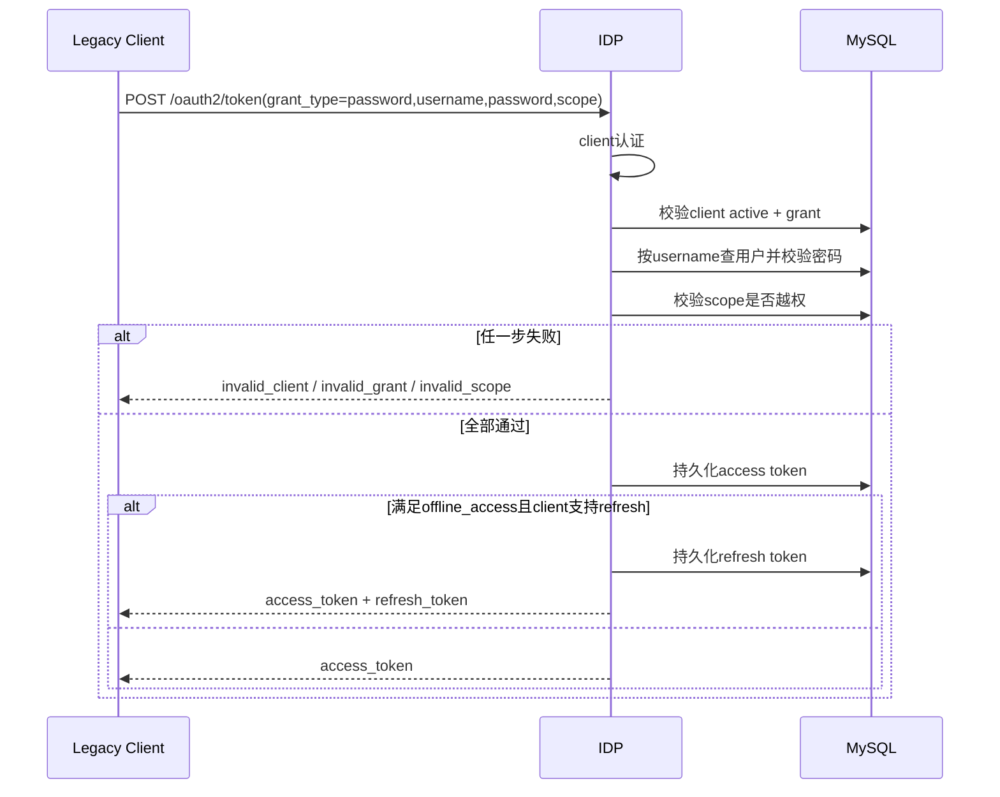
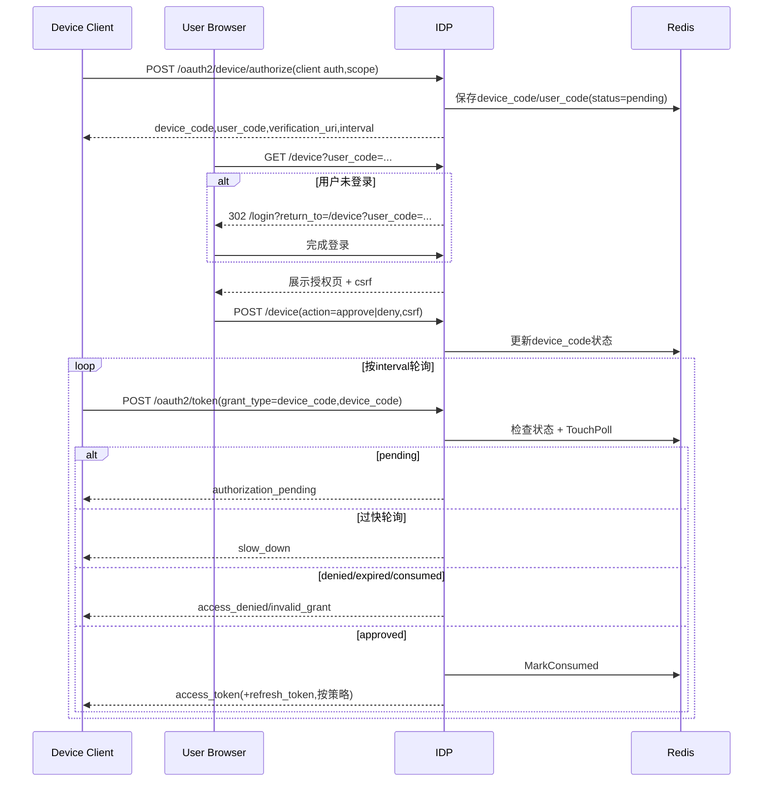

# oauth2-sienne-idp

基于 Go 的 Identity Provider（IDP），实现 OAuth2 + OpenID Connect 主流程，覆盖本地账号、Federated OIDC、MFA（TOTP）、Device Flow、Token Introspection、JWKS 与签名密钥轮转。

## 目录

- [1. 已实现能力](#1-已实现能力)
- [2. HTTP 路由总览](#2-http-路由总览)
- [3. 核心配置项](#3-核心配置项)
- [4. Seed 数据与默认客户端](#4-seed-数据与默认客户端)
- [5. 关键流程说明（时序图）](#5-关键流程说明时序图)
- [6. CSRF 如何实现](#6-csrf-如何实现)
- [7. 重放防护如何实现（详细）](#7-重放防护如何实现详细)
- [8. JWT 与签名密钥如何实现](#8-jwt-与签名密钥如何实现)
- [9. 排障指南](#9-排障指南)
- [10. 当前限制与后续建议](#10-当前限制与后续建议)

## 1. 已实现能力

### 认证与会话

- 本地账号注册、登录、登出
- Federated OIDC 登录（外部身份回调后映射本地用户）
- Browser session（`idp_session`）持久化到 MySQL + Redis
- OIDC End Session（`/connect/logout`）

### MFA

- TOTP 绑定（二维码本地生成，`data:image/png;base64,...`）
- TOTP 登录二步验证（`/login/totp`）
- 强制 MFA 入组策略（`FORCE_MFA_ENROLLMENT=true` 默认开启）
- TOTP step 防重放（按 `user + purpose + step`）

### OAuth2 / OIDC

- Authorization Code + PKCE（`plain` / `S256`）
- Consent 页面与 consent 复用
- Refresh Token Rotation
- `client_credentials`
- `password`（legacy）
- `urn:ietf:params:oauth:grant-type:device_code`
- UserInfo / Introspection / Discovery / JWKS

### 安全控制

- CSRF 双提交校验（cookie + body/header）
- `return_to` 本地路径校验（防开放重定向）
- 登录失败限流 + 用户锁定
- Redis Lua 原子脚本（state/nonce/revoke/rotate 等）

## 2. HTTP 路由总览

以 `idp-server/internal/interfaces/http/router.go` 为准。

### 页面与认证

| 方法 | 路径 | 说明 |
| --- | --- | --- |
| `GET` | `/healthz` | 健康检查 |
| `GET` `POST` | `/register` | 注册（HTML + JSON） |
| `GET` `POST` | `/login` | 本地/Federated 登录入口 |
| `GET` `POST` | `/login/totp` | 登录 TOTP 验证 |
| `GET` `POST` | `/mfa/totp/setup` | TOTP 绑定 |
| `GET` `POST` | `/consent` | 用户同意 |
| `GET` `POST` | `/device` | Device 用户确认 |
| `POST` | `/logout` | 当前会话登出 |
| `GET` `POST` | `/connect/logout` | OIDC End Session |

### OAuth2 / OIDC

| 方法 | 路径 | 说明 |
| --- | --- | --- |
| `GET` | `/.well-known/openid-configuration` | Discovery |
| `GET` | `/oauth2/authorize` | Authorization 入口 |
| `POST` | `/oauth2/token` | Token 交换 |
| `POST` | `/oauth2/device/authorize` | Device Authorization |
| `POST` | `/oauth2/introspect` | Token 自省 |
| `GET` | `/oauth2/userinfo` | UserInfo（Bearer 保护） |
| `GET` | `/oauth2/jwks` | JWKS |

### 客户端管理

| 方法 | 路径 | 说明 |
| --- | --- | --- |
| `POST` | `/oauth2/clients` | 创建客户端 |
| `POST` | `/oauth2/clients/:client_id/redirect-uris` | 注册 redirect URI |
| `POST` | `/oauth2/clients/:client_id/post-logout-redirect-uris` | 注册登出回调 URI |

## 3. 核心配置项

配置读取逻辑在 `idp-server/internal/bootstrap/wire.go`。

### 存储与服务

| 变量 | 默认值 | 说明 |
| --- | --- | --- |
| `MYSQL_DSN` | 空 | 完整 MySQL DSN，优先级最高 |
| `REDIS_ADDR` | 空 | 完整 Redis 地址，优先级最高 |
| `REDIS_KEY_PREFIX` | `idp` | Redis key 前缀 |
| `APP_ENV` | `dev` | 环境名 |
| `ISSUER` | `http://localhost:8080` | OIDC issuer |
| `SESSION_TTL` | `8h` | 会话 TTL |

### 登录风控 / MFA

| 变量 | 默认值 | 说明 |
| --- | --- | --- |
| `FORCE_MFA_ENROLLMENT` | `true` | 未绑定 TOTP 用户登录后强制先绑定 |
| `LOGIN_FAILURE_WINDOW` | `15m` | 登录失败计数窗口 |
| `LOGIN_MAX_FAILURES_PER_IP` | `20` | 单 IP 失败阈值 |
| `LOGIN_MAX_FAILURES_PER_USER` | `5` | 单用户失败阈值 |
| `LOGIN_USER_LOCK_THRESHOLD` | `5` | 达阈值触发锁定 |
| `LOGIN_USER_LOCK_TTL` | `30m` | 锁定时长 |

### JWT / Key Rotation

| 变量 | 默认值 | 说明 |
| --- | --- | --- |
| `JWT_KEY_ID` | `kid-2026-01-rs256` | fallback kid |
| `SIGNING_KEY_DIR` | `scripts/dev_keys` | 私钥目录 |
| `SIGNING_KEY_BITS` | `2048` | RSA 位数 |
| `SIGNING_KEY_CHECK_INTERVAL` | `1h` | 轮转检查间隔 |
| `SIGNING_KEY_ROTATE_BEFORE` | `24h` | 距离 `rotates_at` 多少前触发轮转 |
| `SIGNING_KEY_RETIRE_AFTER` | `24h` | 新 key 上线后旧 key 延迟退役窗口 |

### Federated OIDC

| 变量 | 默认值 | 说明 |
| --- | --- | --- |
| `FEDERATED_OIDC_ISSUER` | 空 | 外部 OP issuer |
| `FEDERATED_OIDC_CLIENT_ID` | 空 | 外部 OP client_id |
| `FEDERATED_OIDC_CLIENT_SECRET` | 空 | 外部 OP secret |
| `FEDERATED_OIDC_REDIRECT_URI` | 空 | 回调 URI |
| `FEDERATED_OIDC_CLIENT_AUTH_METHOD` | `client_secret_basic` | `client_secret_basic`/`client_secret_post`/`none` |
| `FEDERATED_OIDC_SCOPES` | `openid profile email` | 请求 scopes |
| `FEDERATED_OIDC_STATE_TTL` | `10m` | state TTL |

## 4. Seed 数据与默认客户端

来源：`idp-server/scripts/migrate.sql`

### 账号

- `alice / alice123`
- `bob / bob123`
- `locked_user / locked123`

### 客户端

- `web-client`（`authorization_code` + `refresh_token`，`client_secret_basic`，`require_pkce=1`）
- `mobile-public-client`（`authorization_code` + `refresh_token`，`none`，public client）
- `service-client`（`client_credentials`）
- `legacy-client`（`password` + `refresh_token`）
- `tv-client`（`urn:ietf:params:oauth:grant-type:device_code`）

### 预置测试数据

- session：`aaaaaaaa-aaaa-aaaa-aaaa-aaaaaaaaaaaa`
- auth code：`sample_auth_code_abc123`
- code_verifier：`verifier123`
- redirect_uri：`http://localhost:3060/callback`

## 5. 关键流程说明（时序图）

### 5.1 本地登录（含强制 MFA）

参与方：用户浏览器、IDP、Redis、MySQL。  
触发：用户访问受保护资源或 `/oauth2/authorize` 时未登录。  
目标：建立 `idp_session`，在开启强制策略时完成 TOTP 绑定与验证。  
客户端限制：

- 必须处理 302 跳转链：`/login` -> `/mfa/totp/setup`（未绑定且强制）-> `/login/totp`（需要挑战时）
- 所有 POST 必须带 `csrf_token` 且回传 `idp_csrf_token` cookie
- `return_to` 必须是本地路径

### 5.2 Authorization Code + PKCE

参与方：客户端、浏览器、IDP。  
触发：客户端发起 `/oauth2/authorize`。  
目标：签发一次性 `code` 并通过 `code_verifier` 兑换 token。  
客户端限制：

- `redirect_uri` 必须预注册并严格匹配
- `require_pkce=1` 的客户端必须提供 `code_challenge` 与 `code_verifier`
- `scope` 必须是客户端白名单子集

### 5.3 refresh_token

参与方：客户端、IDP、Redis、MySQL。  
触发：access token 过期或即将过期。  
目标：刷新 access token，并按策略轮转 refresh token。  
客户端限制：

- 客户端必须启用 `refresh_token` grant
- 客户端认证方式必须与注册方式一致
- 客户端必须原子替换新 refresh token，避免并发复用旧 token

### 5.4 client_credentials

参与方：服务端客户端、IDP、MySQL。  
触发：服务间调用需要机器身份 token。  
目标：签发 `sub=client_id` 的 access token。  
客户端限制：

- 客户端必须启用 `client_credentials`
- 请求 scope 只能是客户端白名单子集
- 本流程不会返回 refresh token

### 5.5 password（legacy）

参与方：遗留客户端、IDP、MySQL。  
触发：历史系统仍使用用户名密码换 token。  
目标：兼容旧系统，同时维持客户端与用户双重校验。  
客户端限制：

- 客户端必须启用 `password` grant
- 必须先通过 client auth，再校验用户口令
- 用户必须 `active`，`locked/disabled` 直接失败

### 5.6 urn:ietf:params:oauth:grant-type:device_code

参与方：设备客户端、浏览器用户、IDP、Redis。  
触发：受限输入设备需要用户在二次设备上授权。  
目标：设备端轮询获取 token，浏览器端完成批准。  
客户端限制：

- 客户端必须启用 `urn:ietf:params:oauth:grant-type:device_code`
- 轮询必须遵守 `interval`，过快会返回 `slow_down`
- 轮询请求与 device 申请必须使用同一 `client_id`

## 6. CSRF 如何实现

实现位于 `idp-server/internal/interfaces/http/handler/csrf.go`，采用双提交 cookie 模型。

### 6.1 Token 生成

- `ensureCSRFToken` 先读取 `idp_csrf_token` cookie
- 若不存在：生成 32 字节随机数，Base64URL 编码
- 写入 cookie：`Name=idp_csrf_token`，`MaxAge=12h`，`Path=/`

### 6.2 Token 校验

- 优先使用请求体 `csrf_token` 字段
- 若请求体无值，则回退到 Header `X-CSRF-Token`
- 与 cookie 值做 `subtle.ConstantTimeCompare`
- 任一缺失或不一致，返回 `403 invalid csrf token`

### 6.3 覆盖范围

以下写操作均走 `validateCSRFToken`：

- `/login`（POST）
- `/register`（POST）
- `/consent`（POST）
- `/mfa/totp/setup`（POST）
- `/login/totp`（POST）
- `/device`（POST）
- `/logout`（POST）
- `/connect/logout`（POST）

### 6.4 客户端落地要求

- HTML 表单必须回填隐藏字段 `csrf_token`
- AJAX 必须携带 cookie，并传 `X-CSRF-Token` 或 body `csrf_token`
- 获取页面后再提交（先 GET 拿 token，后 POST）

## 7. 重放防护如何实现（详细）

系统不是单点防护，而是按“凭证类型”分层防重放。

### 7.1 Authorization Code 一次性消费

- 数据层：`oauth_authorization_codes.consumed_at`
- 消费逻辑：`ConsumeByCode`（事务 + `SELECT ... FOR UPDATE`）
- 规则：已消费或过期立即失败
- 成本：一次 DB 行锁，换取强一致一次性

### 7.2 Federated OIDC state / nonce

- `state`：`save_oauth_state.lua` 通过 `EXISTS` + `HSET` + `EXPIRE`，只允许首次写入
- `state` 消费：`consumeState` 读取后立刻删除，二次回调失败
- `nonce`：`reserve_nonce.lua` 使用 `SET NX EX`，同 nonce 只能保留一次

### 7.3 Refresh Token Rotation

- 旧 refresh 先查 revoked 标记，再查 DB 活跃记录
- 轮转脚本：`rotate_token.lua`
- 原子动作：
  - 标记旧 token `revoked=1`
  - 写 old revoked key
  - 写新 refresh token 记录
  - 更新 rotated 链路
- 并发重复使用同一旧 token，会落入 `-2` 路径并失败

### 7.4 TOTP Step 防重放（按 purpose）

- Key 形态：`{prefix}:{env}:mfa:totp:used:{userId}:{purpose}:{step}`
- 写入方式：`SET NX EX`（TTL=120s）
- `purpose` 已分层：
  - `login`
  - `enable_2fa`
  - `reset_password`（接口常量已定义，便于后续扩展）
- 含义：同一用户在同一用途、同一步长时间窗内，验证码只能成功一次

### 7.5 Device Code 防重放

- `device_code` 状态机：`pending -> approved|denied -> consumed`
- 轮询频率：`TouchPoll` 按 `interval` 控制，过快返回 `slow_down`
- 消费：签发 token 后立即 `MarkConsumed`

### 7.6 失效边界与代价

- 代价：增加 Redis 写入与状态管理复杂度
- 收益：把“同凭证重复使用”压成确定失败路径
- 边界：
  - Redis 全局故障时，依赖 DB 的防重放（如 auth code）仍在，但 state/nonce/TOTP step 保护会降级
  - 多实例场景必须共享同一 Redis，防重放才具备全局一致性

## 8. JWT 与签名密钥如何实现

### 8.1 签名与验证

- 实现：`internal/infrastructure/crypto/signer.go`
- 算法：`RS256`
- 头部：`typ=JWT`，`kid=<active kid>`
- 签名：`rsa.SignPKCS1v15(SHA-256)`
- 验签：根据 `kid` 查公钥，校验 `alg` 与签名

### 8.2 Claim 校验

- 实现：`jwt.go`
- `ParseAndValidate` 校验：
  - `iss`
  - `aud`（字符串或数组）
  - `sub`
  - `exp`（必须在未来）
  - `nbf`/`iat`（不能在未来）

### 8.3 Key Manager 数据模型

- 元数据表：`jwk_keys`
- 核心字段：`kid/kty/alg/use_type/public_jwk_json/private_key_ref/is_active/rotates_at/deactivated_at`
- 内存结构：`KeyManager` 持有 `kid -> key` 映射与 `activeKID`

### 8.4 Key 加载与回退

- 启动优先 `EnsureKeyManager`：
  - 先确保有可用 active key（必要时触发轮转）
  - 再从 DB 记录 + `private_key_ref` 加载私钥/公钥
- 若加载失败：回退 `NewGeneratedRSAKeyManager`（进程内临时 RSA key）

### 8.5 轮转机制

- 实现：`key_rotation.go`
- 触发条件：
  - 无 active key
  - 或 active key 的 `rotates_at` 已进入 `RotateBefore` 窗口
- 新 key 生成：
  - 生成 RSA 私钥
  - 私钥写入 `SIGNING_KEY_DIR/<kid>.pem`
  - 公钥写成 JWK JSON 入库
  - 标记新 key active，并安排旧 key 退役时间（`RetireAfter`）
- 后台循环：`StartRotationLoop` 按 `SIGNING_KEY_CHECK_INTERVAL` 周期检查并热更新内存 key manager

### 8.6 JWKS 发布

- 接口：`GET /oauth2/jwks`
- 内容来源：`KeyManager.PublicJWKS()`
- 用途：资源服务器按 `kid` 拉取公钥验证 access token/id token

## 9. 排障指南

### `/oauth2/token` 返回 `invalid_client`

- 检查客户端 `token_endpoint_auth_method` 与请求方式是否一致
- `client_secret_basic` 时，不能同时再传 body 的 `client_id/client_secret`
- `none` 时，必须无 `Authorization` 且 `client_secret` 为空

### 授权码兑换返回 `invalid_grant`

- 常见原因：
  - `code` 已消费
  - `redirect_uri` 与授权阶段不一致
  - `code_verifier` 与 challenge 不匹配

### 登录后被强制跳转 `/mfa/totp/setup`

- `FORCE_MFA_ENROLLMENT=true` 且用户尚未绑定 TOTP 时属于预期行为

### TOTP 一直失败

- 确认设备时间同步（TOTP 按 30s step）
- 确认验证码未在同一步长重复提交（会触发重放保护）

### Device Flow 轮询收到 `slow_down`

- 轮询间隔小于服务端返回的 `interval`
- 按 `interval` 或更慢频率轮询

## 10. 当前限制与后续建议

- `password` grant 仍保留为兼容路径，建议逐步下线至 `authorization_code + PKCE`
- Key rotation 当前为单进程定时循环，多实例生产建议增加分布式锁或独立控制面
- Federated OIDC 当前是“外部身份映射到已存在本地用户”，尚未内建首登自动建号
- 重放防护依赖 Redis 的流程（state/nonce/TOTP step/device poll）在 Redis 不可用时会降级
