# idp-server Sequence 图

基于 [detail.md](/F:/source%20code/palyground/workspace/idp-server/detail.md) 中现有流程整理。

## 1. Web Client 向 idp-server 请求

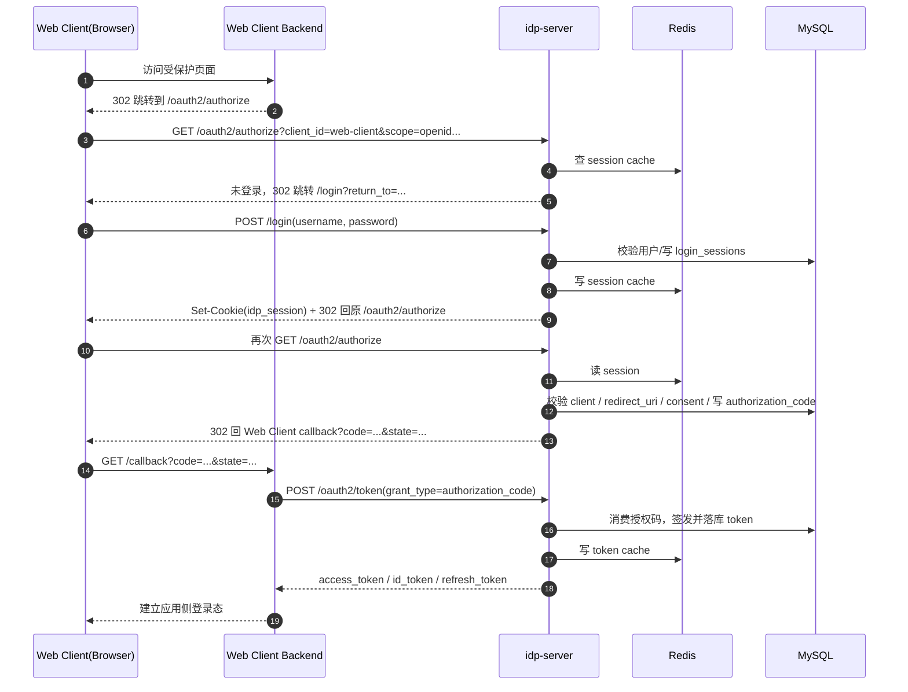

## 2. Mobile Client 向 idp-server 请求

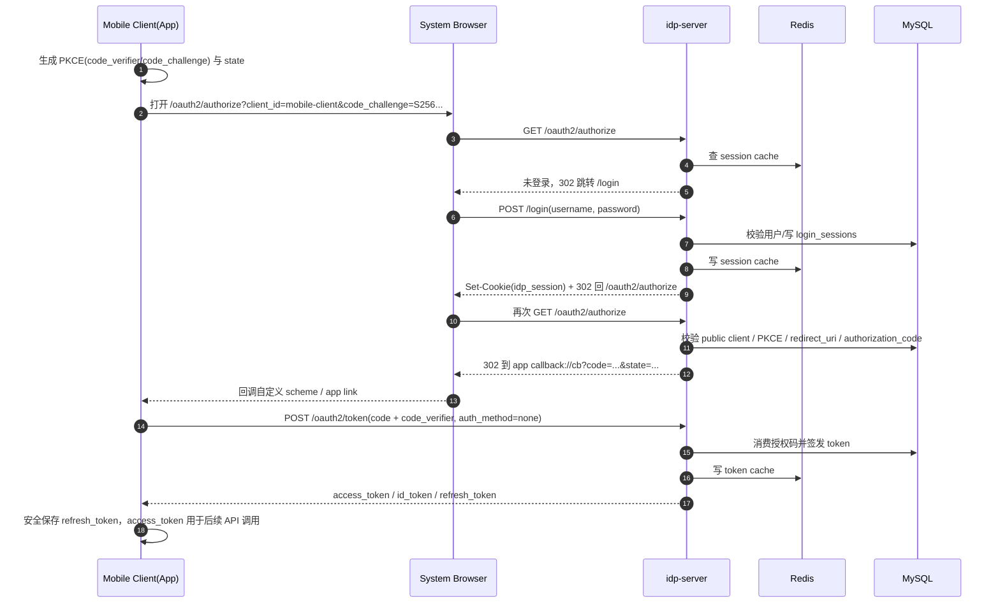

## 3. OpenID 认证方式

`openid` 这里按 OIDC Authorization Code 流程画，重点是会返回 `id_token`，并可继续调 `userinfo`。

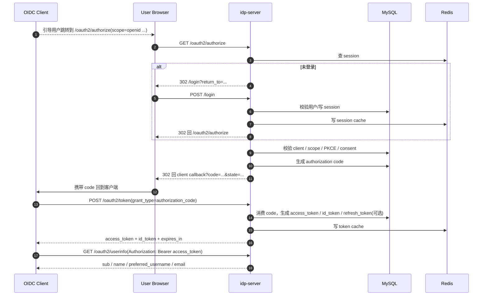

## 4. client_credentials 认证方式

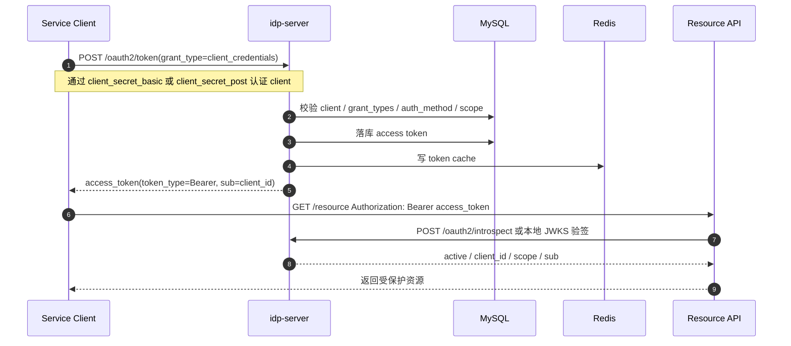

## 5. API 访问方式

`api` 这里按“客户端拿到 access token 后访问资源服务”来画。资源服务有两条校验路径：本地 JWKS 验签，或回源 introspection。

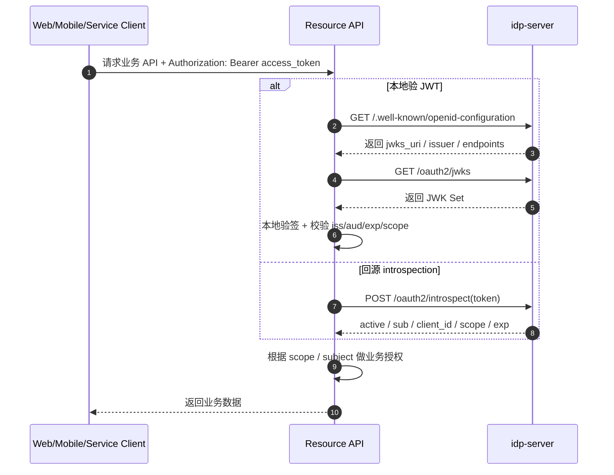

## 6. 用户名密码登录

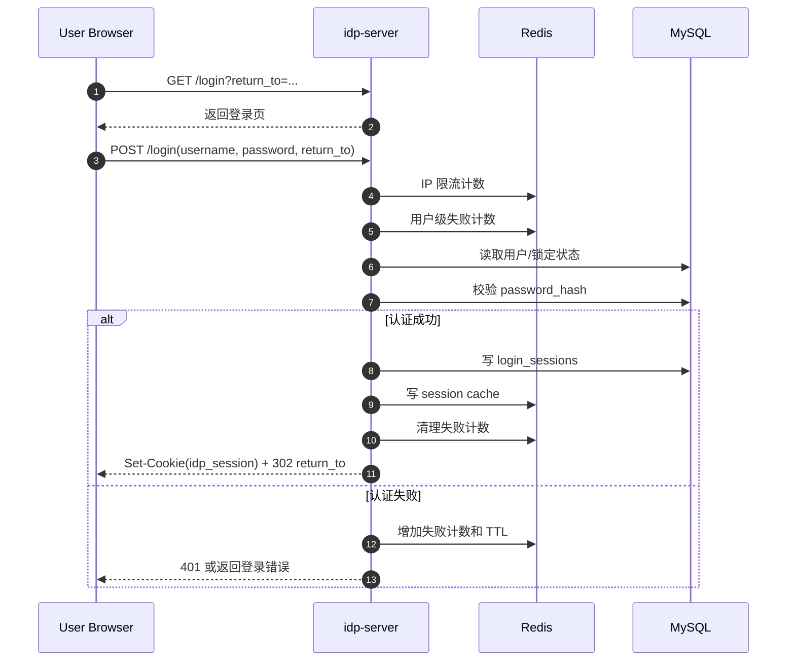

## 7. 联邦 OIDC 登录

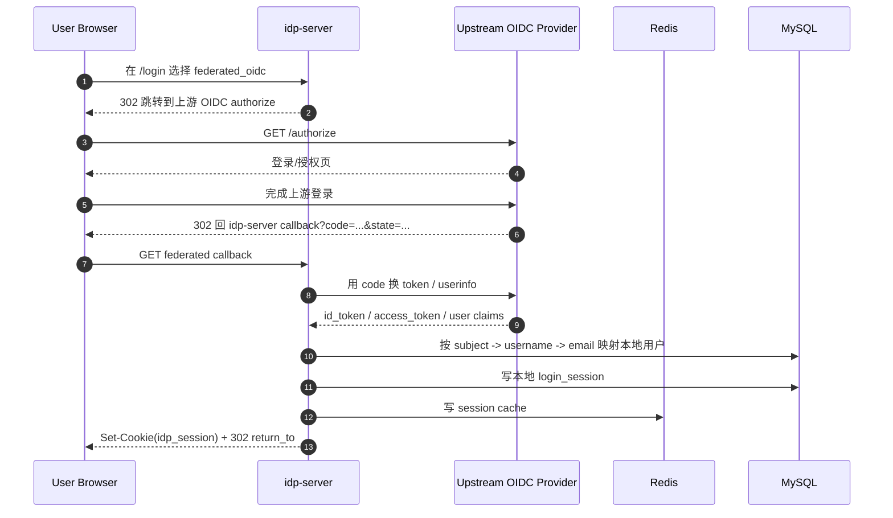

## 8. Consent 授权确认

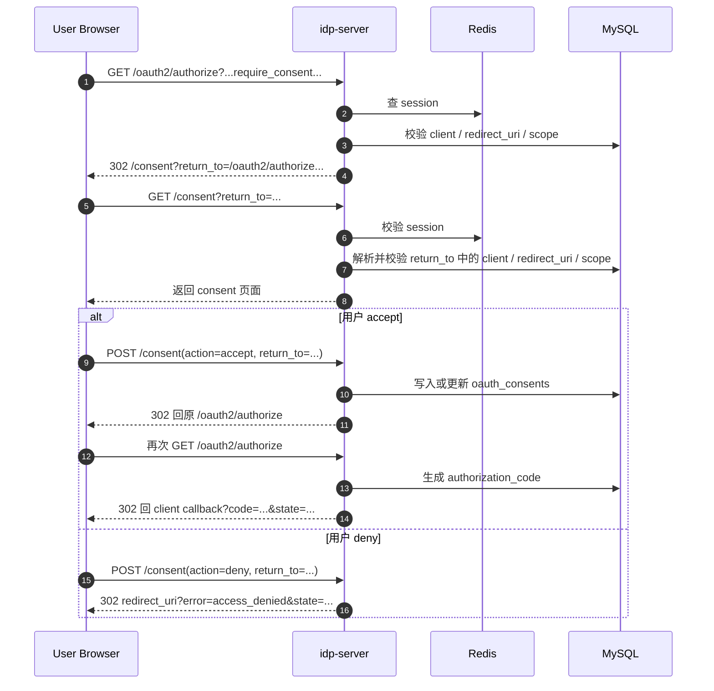

## 9. Refresh Token 轮换

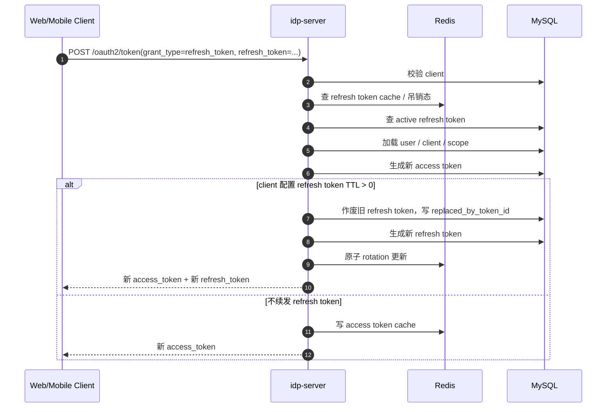

## 10. 本地 Session 注销

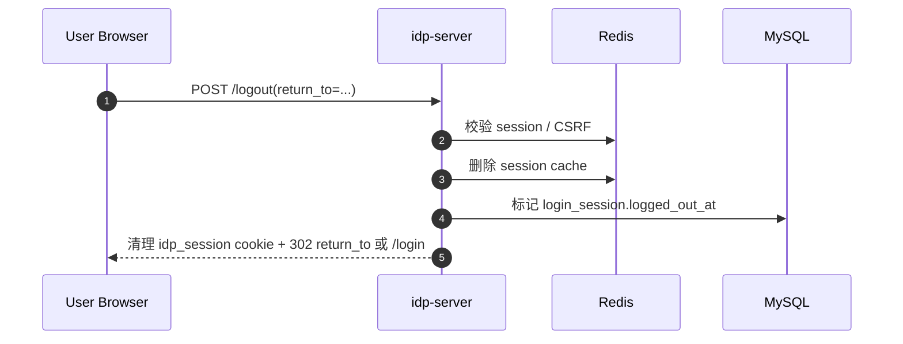

## 11. OIDC RP-Initiated Logout

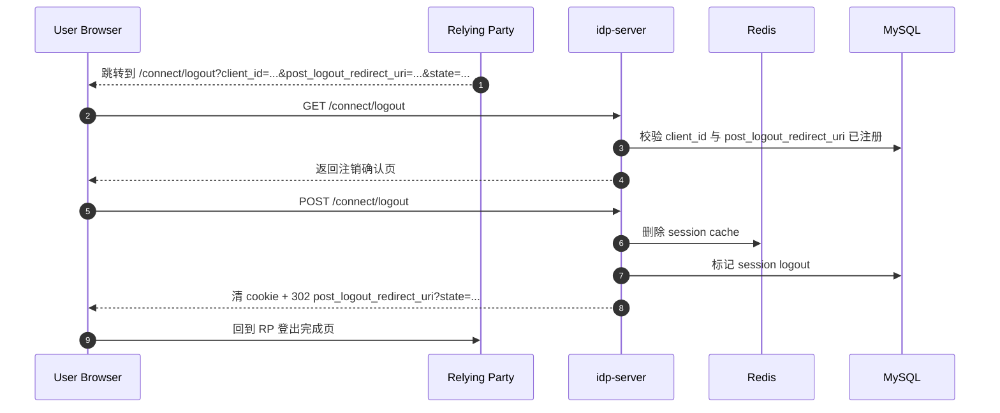

## 12. 动态创建 OAuth Client

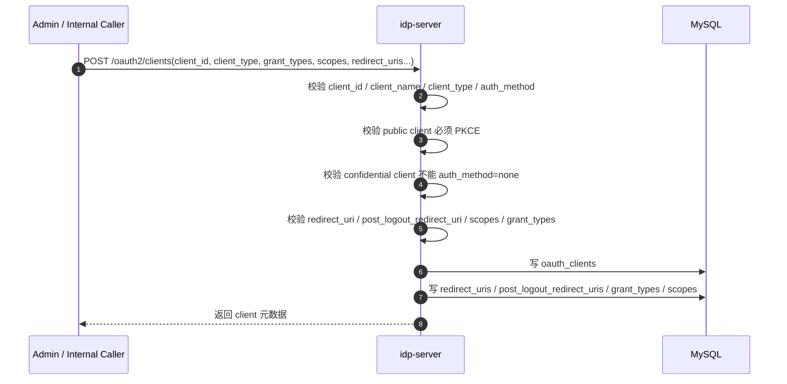

## 13. MFA 两阶段认证

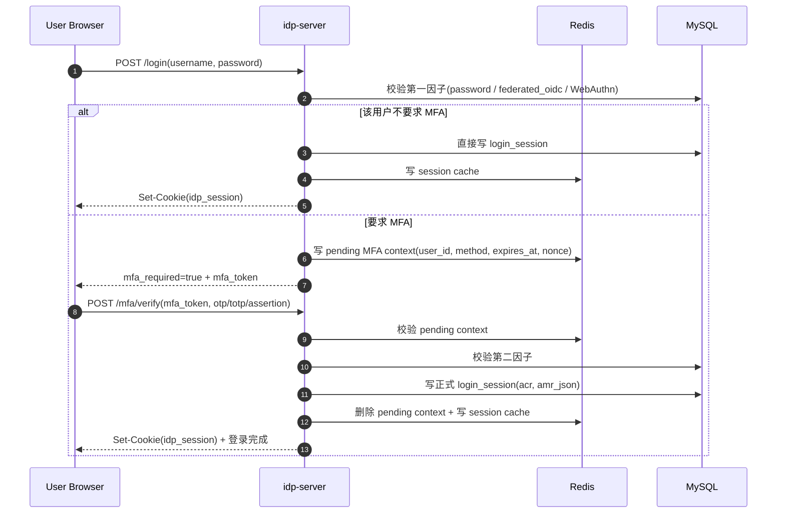

## 14. 二维码登录

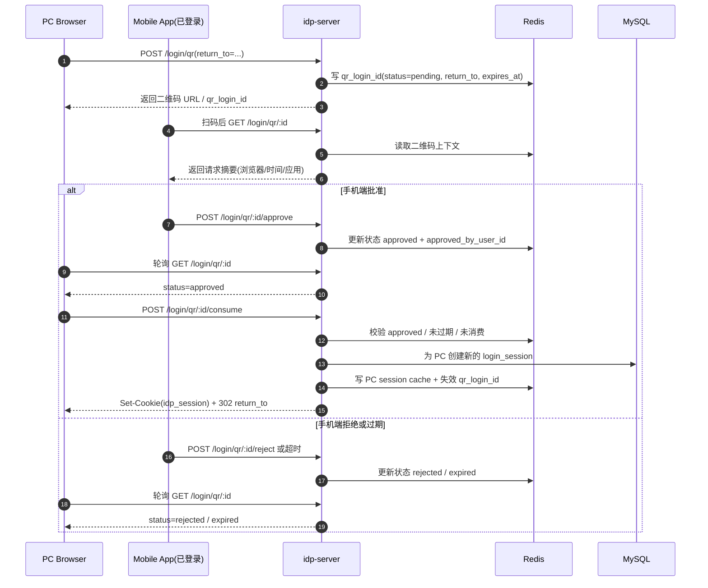

## 15. WebAuthn (Passkey) 注册流程

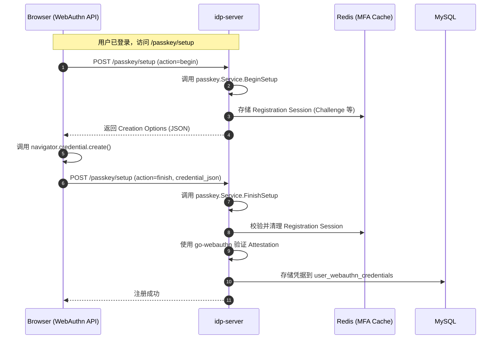

## 16. WebAuthn (Passkey) 登录流程 (作为 MFA)

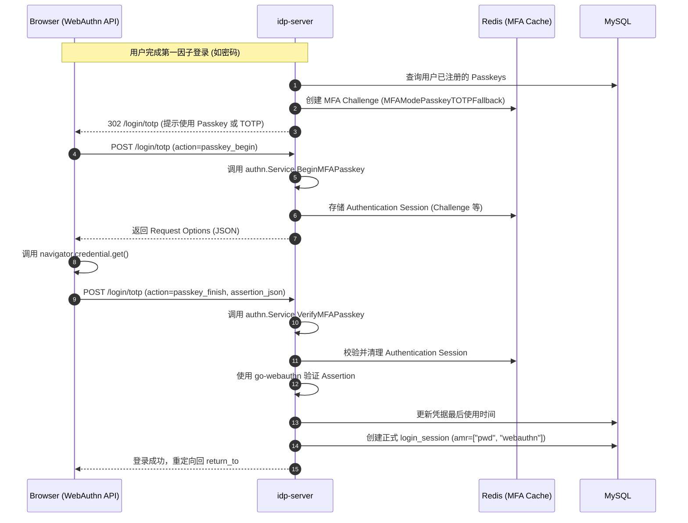
