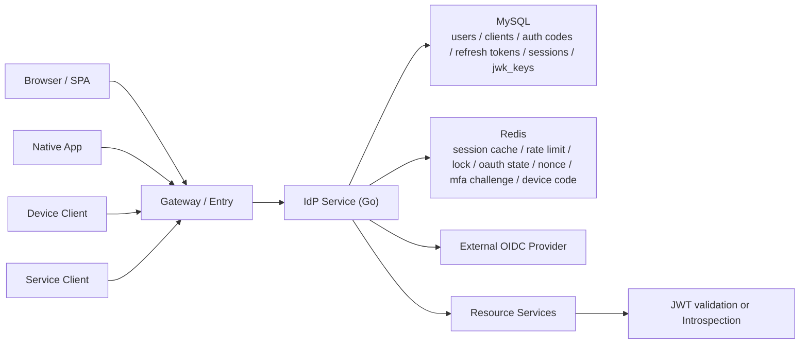
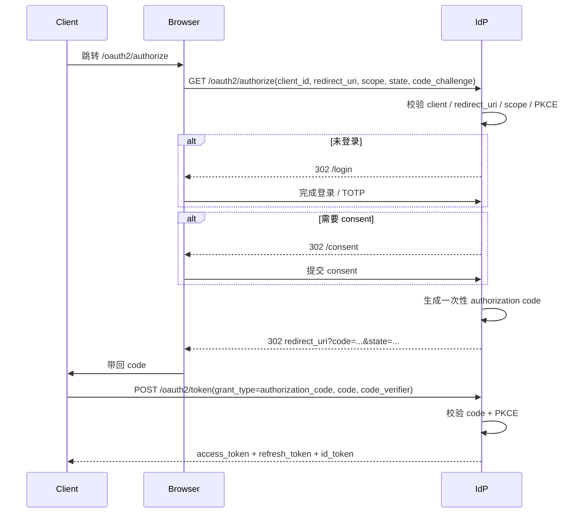
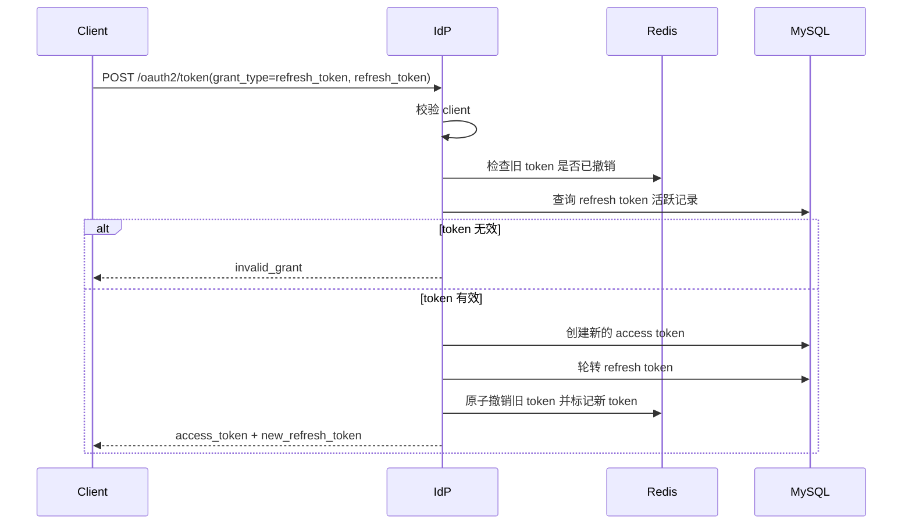
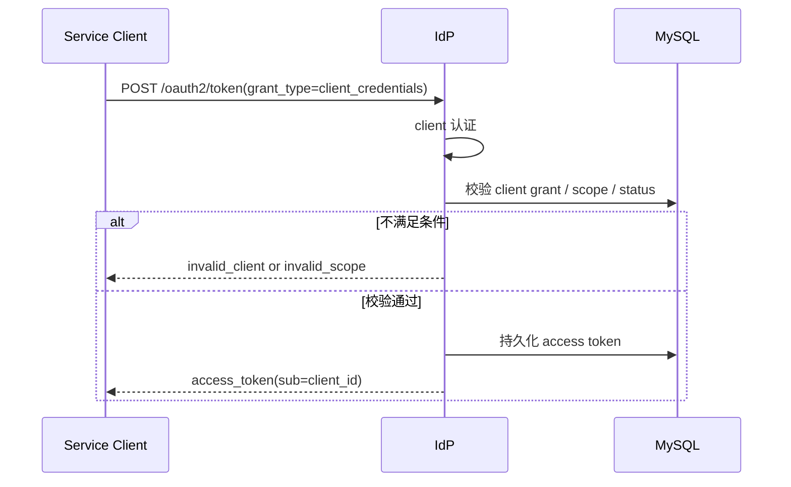
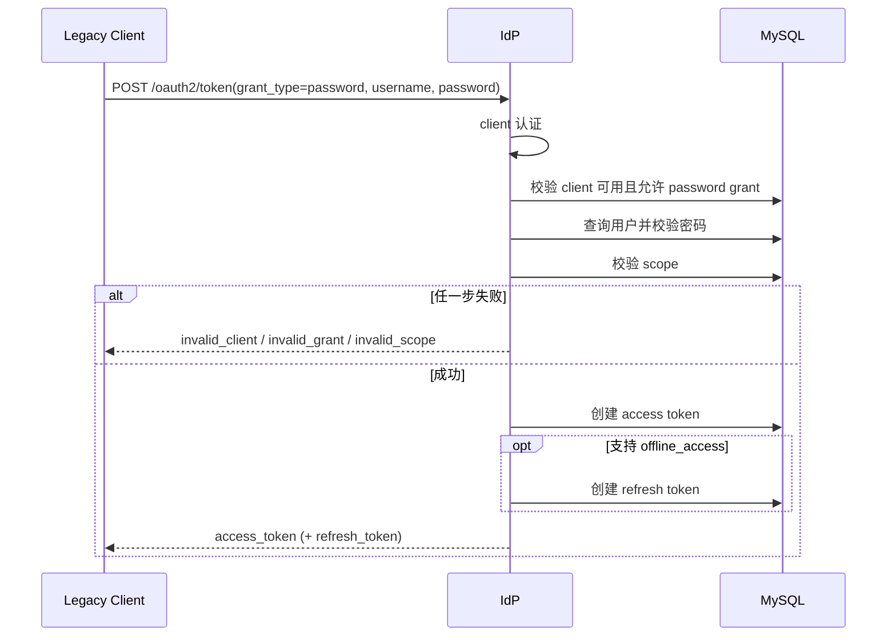
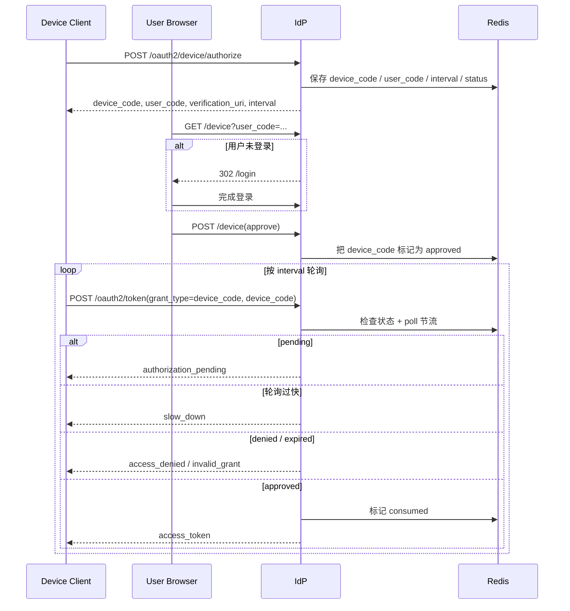
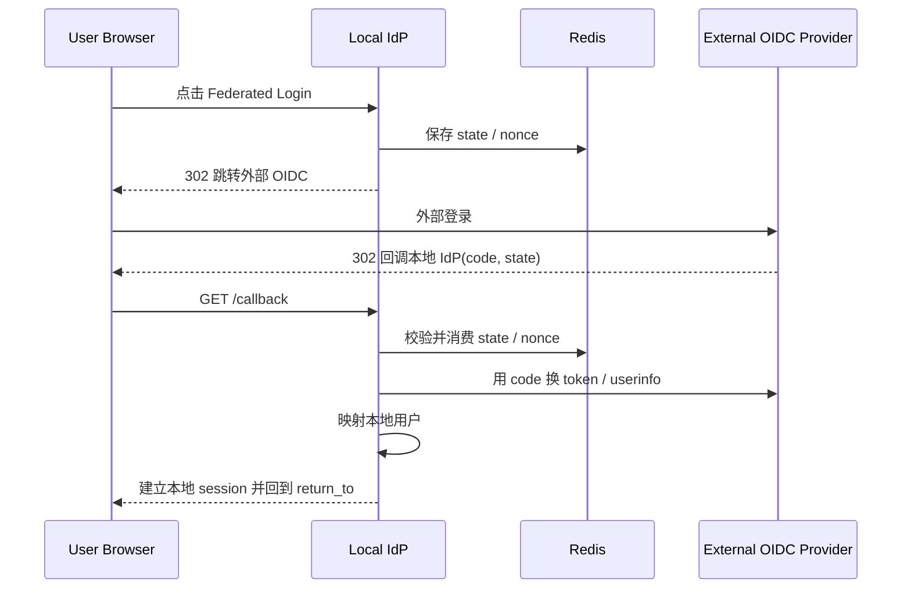
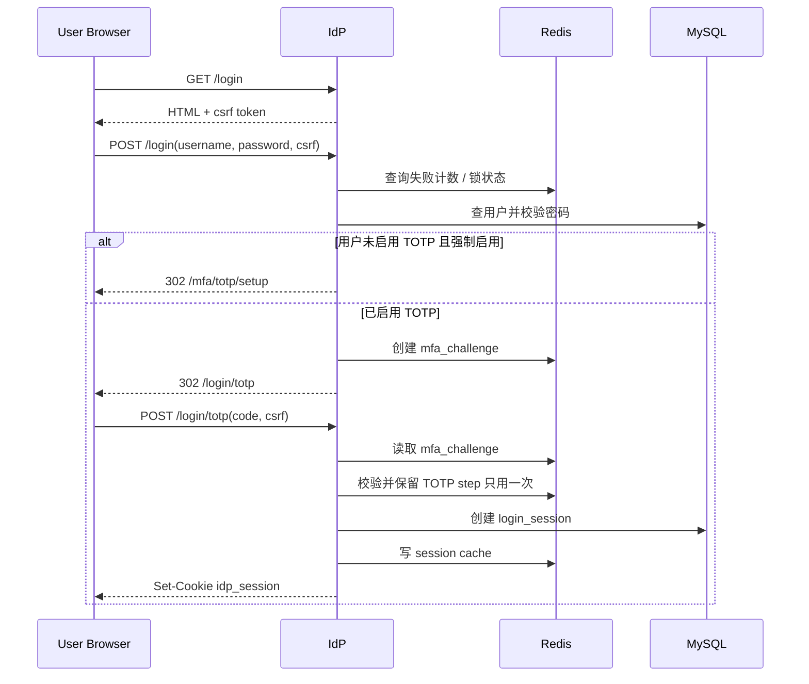

# oauth2-sienne-idp 面试说明

## 1. 项目定位

这个项目不是“写了一个登录接口”，而是实现了一套面向分布式系统的统一认证与授权中心。

它的核心定位可以这样讲：

- 基于 Go 实现 Identity Provider（IdP）
- 支持 OAuth2 + OpenID Connect 主流程
- 统一承载浏览器登录、服务间调用、设备授权、联邦登录和多因素认证
- 面向多服务、多客户端、多实例部署场景设计

面试里最推荐的表述：

> 我设计并实现了一个统一认证与授权中心，基于 OAuth2/OIDC 构建多客户端、多服务的认证体系，支持本地账号、Federated OIDC、MFA（TOTP）、Device Flow、JWT 签发、JWKS 与签名密钥轮转，并通过 Redis + MySQL 共同承载会话、热状态与持久化数据，使系统具备分布式部署能力。

---

## 2. 这个项目为什么加分

### 2.1 能体现的能力

- 安全体系能力：OAuth2/OIDC、JWT、CSRF、防重放、MFA、密钥轮转
- 分布式架构能力：应用无状态、共享 Redis/MySQL、JWT 下沉到资源服务
- 系统设计能力：多种 grant type、会话模型、令牌生命周期、热状态与冷数据分层
- 工程能力：插件式认证、路由分层、Repo/Cache/Service 解耦、Lua 原子脚本

### 2.2 面试官最看重什么

不是“你做了 OAuth2 server”，而是：

- 你实现了哪些流程
- 为什么这样拆存储
- 为什么 JWT 还要配 Redis
- refresh token 为什么要 rotation
- 为什么 TOTP 要做 challenge 而不是直接下发 session
- 哪些地方是强一致，哪些地方是最终一致

一句话：

> 做出来只是及格，讲清设计权衡才是高分。

---

## 3. 已实现能力总览

### 3.1 认证与会话

- 本地注册、登录、登出
- 浏览器 Session（`idp_session`）
- Federated OIDC 登录
- OIDC End Session

### 3.2 OAuth2 / OIDC

- `authorization_code`
- `authorization_code + PKCE`
- `refresh_token`
- `client_credentials`
- `password`（legacy）
- `urn:ietf:params:oauth:grant-type:device_code`
- Discovery
- UserInfo
- Token Introspection
- JWKS

### 3.3 MFA

- TOTP 绑定
- 二步验证登录
- 强制 MFA 入组策略
- TOTP step 防重放

### 3.4 安全控制

- CSRF 双提交校验
- `return_to` 本地路径校验
- Redis 登录失败限流和锁定
- Refresh Token Rotation
- Device Code 轮询频率控制
- 签名密钥轮转

---

## 4. 整体架构怎么讲

### 4.1 架构分层

- Client 层：Browser、SPA、Native App、Device Client、Service Client
- Entry 层：网关或直接进入 IdP
- IdP 应用层：认证、授权、令牌签发、MFA、Federated OIDC
- Persistence 层：MySQL
- Hot State 层：Redis
- Resource Server：校验 JWT 或调用 Introspection

### 4.2 为什么说它是分布式认证中心

因为应用实例本身尽量无状态：

- 会话写入 MySQL + Redis
- 防重放状态放 Redis
- token 是 JWT，可由资源服务分布式校验
- 多个 IdP 实例共享同一套 Redis/MySQL 即可横向扩容

所以更准确的说法是：

> 这是一个为分布式场景设计的认证中心，而不是依赖单机内存 Session 的登录系统。

### 4.3 架构图



---

## 5. 代码结构怎么讲

### 5.1 分层设计

项目采用了比较典型的分层结构：

- `internal/interfaces/http`：HTTP handler、router、dto
- `internal/application`：核心业务服务，编排认证、授权、发 token、MFA
- `internal/domain`：领域模型
- `internal/ports`：仓储、缓存、安全能力的抽象接口
- `internal/infrastructure`：MySQL、Redis、crypto、外部 OIDC 等实现
- `internal/plugins`：grant handler、authn method 等可扩展实现

### 5.2 为什么这样分

这样分层的好处是：

- HTTP 协议细节不会污染核心业务
- Redis / MySQL / 密码学实现可以替换
- grant_type 与认证方式可以插件化扩展
- 更方便做单元测试和面试时讲清职责边界

### 5.3 面试推荐讲法

> 我把接口层、业务层、领域层和基础设施层做了清晰拆分，HTTP 只负责解析和返回，核心逻辑在 application service，中间通过 ports 抽象 repo、cache 和 security provider。这样后面扩展 `password grant`、`device_code`、TOTP，都是在既有边界上增加能力，而不是把逻辑堆在 controller 里。

---

## 6. 关键存储模型怎么讲

### 6.1 MySQL 负责什么

MySQL 负责持久化、审计友好、强一致要求更高的数据：

- `users`
- `login_sessions`
- `oauth_clients`
- `oauth_authorization_codes`
- `oauth_access_tokens`
- `oauth_refresh_tokens`
- `user_totp_credentials`
- `jwk_keys`

### 6.2 Redis 负责什么

Redis 负责热状态、临时状态、高频读写状态：

- session cache
- 登录失败计数与用户锁定
- OAuth `state`
- OIDC `nonce`
- refresh token revoked / rotate 热状态
- TOTP enrollment 临时状态
- MFA challenge
- TOTP step reuse 防重放
- device code 状态与 poll 节流

### 6.3 为什么不用单一存储

因为职责不同：

- 只用 MySQL：高频热状态成本高，实时性与吞吐差
- 只用 Redis：持久化、审计、排障与一致性不足

所以这里的思路是：

> MySQL 存“事实”，Redis 存“热状态和控制面”。

---

## 7. Token 和 Session 设计

### 7.1 为什么选 JWT

JWT 的优点：

- 资源服务本地可验签
- 减少回源认证中心
- 适合微服务和多实例部署

### 7.2 为什么 JWT 还要配 Redis

因为纯 JWT 的缺点是难以及时失效控制。

所以这里是标准生产折中：

- JWT 负责无状态分发
- Redis 负责撤销、黑名单、rotation 热状态
- MySQL 负责持久化 token 记录和追踪链路

### 7.3 本项目里的几类状态

- `access_token`：JWT，给资源服务
- `refresh_token`：长生命周期，支持续期
- `idp_session`：浏览器登录态
- `login_session`：服务端持久化会话记录
- `device_code`：设备授权中间态
- `mfa_challenge`：密码通过但 MFA 尚未完成的临时挑战态

### 7.4 面试推荐说法

> 我的 token 设计不是单纯只发 JWT，而是把 JWT、Redis 和 MySQL 三层配合起来：JWT 用于分布式鉴权，Redis 用于热状态和失效控制，MySQL 负责持久化和审计追踪，这是比较贴近生产的设计。

---

## 8. 支持了哪些 OAuth2 / OIDC 流程

### 8.1 `authorization_code + PKCE`

适用对象：

- Web
- SPA
- Native App

作用：

- 最标准的用户授权流程
- 防止授权码被截获后二次兑换

关键点：

- client 校验
- redirect URI 严格匹配
- scope 白名单校验
- `code_challenge` / `code_verifier` 校验
- code 一次性消费

### 8.2 `refresh_token`

作用：

- 在不让用户重新登录的情况下续期 access token

关键点：

- refresh token 必须绑定 client
- 校验 revoked / expired / active
- 支持 rotation，旧 token 被替换后立即失效

### 8.3 `client_credentials`

适用对象：

- 服务间调用
- 机器身份访问

特点：

- 无用户参与
- `sub=client_id`
- 不返回 refresh token

### 8.4 `password`

定位：

- 兼容 legacy 系统
- 不推荐新系统使用

特点：

- 先 client auth
- 再用户口令校验
- 可按 scope 和 refresh 策略发 token

### 8.5 `device_code`

适用对象：

- TV
- 机顶盒
- 输入能力受限的设备

特点：

- 设备申请 `device_code`
- 用户在浏览器完成批准
- 设备按 `interval` 轮询
- 支持 `authorization_pending` / `slow_down` / `access_denied`

### 8.6 Federated OIDC 登录

作用：

- 把外部身份系统接入到本地认证中心

特点：

- 对外部 OIDC Provider 发起授权
- 校验 `state` / `nonce`
- 外部身份回调后映射本地用户
- 最终仍落回本地 session / 本地 token 体系

### 8.7 OIDC 相关接口

- Discovery
- JWKS
- UserInfo
- Introspection

这说明项目不是只有“发 token”，而是把 OIDC 生态里常见的基础接口也补齐了。

---

## 9. 各个登录流程的 Mermaid 时序图

### 9.1 Authorization Code + PKCE



### 9.2 Refresh Token Rotation



### 9.3 Client Credentials



### 9.4 Password Grant



### 9.5 Device Code



### 9.6 Federated OIDC Login



### 9.7 本地登录 + TOTP 二步验证



---

## 10. TOTP / MFA 是怎么做的

### 10.1 为什么要加 TOTP

因为单密码登录存在以下风险：

- 密码泄漏后直接被接管
- 浏览器端登录态一旦被冒用，风险较大
- 面试里也无法体现“高安全级认证设计”

所以 TOTP 的意义是：

- 把认证从单因素升级为多因素
- 给敏感系统提供更强登录保障
- 为后续 step-up authentication 留接口

### 10.2 绑定流程

- 登录后进入 `/mfa/totp/setup`
- 生成 secret 和 provisioning URI
- 页面显示二维码
- 用户用 Authenticator 扫码
- 用户提交一次 6 位验证码
- 服务端校验通过后把 TOTP 凭据持久化到 `user_totp_credentials`

### 10.3 登录二步验证流程

- 第一步：用户名密码校验成功
- 第二步：如果用户已启用 TOTP，则不立刻签发最终 session
- Redis 中创建 `mfa_challenge`
- 跳转到 `/login/totp`
- 验证通过后才创建最终 `idp_session`

### 10.4 为什么要 challenge，而不是直接登录成功

因为密码通过不代表 MFA 完成。

如果密码通过后先签 session，再补 TOTP，会有明显的安全漏洞：

- 攻击者只要拿到密码，就可能先获得部分登录能力
- 会话边界不清晰
- 下游系统难以判断“这次登录是否完成 MFA”

所以更合理的设计是：

> 密码通过后只进入待验证态，TOTP 成功后才发最终 session。

### 10.5 TOTP 防重放怎么做

- 按 `user + purpose + time step` 构造 Redis key
- 用 `SET NX EX` 保证同一 step 只允许成功一次
- `purpose` 分为 `login`、`enable_2fa` 等

这样能防止：

- 同一个 30 秒时间窗内验证码被重复成功使用
- 绑定阶段和登录阶段互相串用

### 10.6 MFA 完成后怎么表达认证强度

可以在 session / token claim 里体现：

- `amr=["pwd","otp"]`
- `acr=urn:idp:acr:mfa`

面试里这是很加分的点，因为说明你考虑的是“认证等级”，而不是只会做表单校验。

---

## 11. CSRF 是怎么做的

### 11.1 当前方案

当前采用 `Double Submit Cookie`：

- 服务端 GET 页面时生成 `idp_csrf_token`
- 一份写 cookie
- 一份放到表单 hidden field 或前端 header
- POST 时比较 cookie 和 body/header 是否一致

### 11.2 为什么先 GET 再 POST

因为浏览器必须先拿到合法 token，之后提交 POST 才能通过校验。

流程本质上是：

1. GET 页面领取 CSRF token
2. POST 提交时回传 token
3. 服务端做 challenge-response 校验

### 11.3 hidden field 是什么

就是表单里的隐藏字段，例如：

```html
<input type="hidden" name="csrf_token" value="server-generated-token">
```

浏览器提交时会自动带上：

```http
POST /login
Cookie: idp_csrf_token=abc

csrf_token=abc&username=alice&password=alice123
```

### 11.4 和服务端 Session CSRF 的区别

Double Submit Cookie：

- 服务端不存 token 状态
- 更轻量
- 更适合当前这种 HTML + 轻 API 场景

Session-based CSRF：

- token 保存在服务端 session
- 控制力更强
- 但要维护更多服务端状态

### 11.5 覆盖了哪些入口

- `/login`
- `/register`
- `/consent`
- `/mfa/totp/setup`
- `/login/totp`
- `/device`
- `/logout`
- `/connect/logout`

---

## 12. XSS / SSRF 怎么讲

### 12.1 XSS 当前做了什么

- 使用服务端模板默认转义
- Session Cookie 使用 `HttpOnly`
- 输入不直接作为原始 HTML 注入
- `return_to` 做本地路径限制，减少开放跳转和参数注入风险

### 12.2 XSS 还缺什么

如果上生产，建议补：

- `Content-Security-Policy`
- `X-Content-Type-Options: nosniff`
- `frame-ancestors` 或 `X-Frame-Options`
- `Secure` cookie
- 更严格的模板与富文本输出策略

### 12.3 SSRF 当前风险面在哪里

主要在 Federated OIDC 外呼：

- discovery
- token endpoint
- userinfo endpoint

### 12.4 当前是怎么控制的

- 外呼地址主要来自服务端配置的 issuer
- 不是让用户直接传任意 URL

### 12.5 如果上生产还要怎么做

- issuer 白名单
- 禁止内网 / 回环 / link-local 地址
- 对 discovery 返回的 endpoint 做二次校验
- 网络层出站白名单
- DNS rebinding 防护

面试推荐说法：

> 当前 SSRF 风险面主要集中在联邦 OIDC 外呼，我已经通过服务端配置收敛了输入来源，但如果上生产还会补 issuer 白名单、私网地址拦截、discovery 结果校验以及网络层出站访问控制。

---

## 13. 防重放怎么讲

这个项目不是“只有一个 nonce”，而是分凭证做多层防重放。

### 13.1 Authorization Code

- code 一次性消费
- `consumed_at`
- 事务或锁保证只可兑换一次

### 13.2 OIDC `state`

- Redis 中只允许首次写入
- 回调成功后立即消费

### 13.3 OIDC `nonce`

- `SET NX EX`
- 保证同 nonce 只保留一次

### 13.4 Refresh Token

- rotation
- 旧 token 被替换后立即撤销
- 并发重复使用会落入失败路径

### 13.5 TOTP

- 按 step 一次性使用

### 13.6 Device Code

- 状态机控制 `pending -> approved/denied -> consumed`
- 签发 token 后立即 consumed

面试里最好不要只说“做了防重放”，而要说：

> 我把不同类型的凭证分别做了重放控制，因为 authorization code、refresh token、TOTP 和 device code 的生命周期、风险面和一致性要求并不一样。

---

## 14. JWT 与签名密钥轮转怎么讲

### 14.1 为什么不是固定密钥

固定私钥长期使用的问题：

- 泄漏后影响范围大
- 无法平滑更新
- 不利于多实例和长期运维

### 14.2 现在怎么做

- 使用 `RS256`
- 当前 active key 签发新 token
- 通过 `kid` 标识签名 key
- 公钥通过 `/oauth2/jwks` 发布
- 资源服务按 `kid` 获取对应 JWK 验签

### 14.3 轮转过程

- 生成新 RSA key
- 私钥写到文件
- 公钥转成 JWK 入库
- 新 key 设为 active
- 旧 key 在 `RetireAfter` 窗口后退役

### 14.4 为什么要保留旧 key 一段时间

因为旧 token 还在有效期内。

如果立刻删除旧 key，会导致：

- 老 token 无法验签
- 多服务出现短时认证雪崩

所以标准做法是：

> 新旧 key 共存一段时间，等待旧 token 自然过期后再退役旧 key。

---

## 15. 登录接口能不能扛高并发

### 15.1 结论

现在这套登录接口具备一定并发能力，但更准确的表述是：

> 中等并发可用，离“高并发登录入口”还有优化空间。

### 15.2 优点

- 应用层基本无状态，可横向扩容
- Redis 承担失败计数、锁定、session cache
- MySQL 和 Redis 职责分层明确
- 没有单机内存 session 锁死在单节点

### 15.3 主要瓶颈

- bcrypt 校验吃 CPU
- 登录成功链路同步写 MySQL + Redis
- MySQL 连接池会成为硬瓶颈
- 高峰期失败流量会放大风控和数据库压力

### 15.4 高并发改造优先级

1. MySQL 连接池改成可配置并调大
2. 网关和应用层增加登录限流
3. 把非关键写操作异步化
4. 对 bcrypt 做容量测试和成本治理
5. Redis 优化热路径与原子脚本

### 15.5 面试建议回答

> 我不会直接说登录接口能扛高并发，而是会先拆瓶颈：CPU 在密码哈希，IO 在 MySQL 和 Redis，同步写会影响 RT。当前架构支持横向扩容，但要真正做到高并发登录入口，还需要连接池治理、入口限流、热路径异步化和压测基线建设。

---

## 16. grant_type 具体实现到什么程度

### 16.1 已落地的 grant

- `authorization_code`
- `refresh_token`
- `client_credentials`
- `password`
- `urn:ietf:params:oauth:grant-type:device_code`

### 16.2 为什么这是加分点

因为不是只做了一个 happy path，而是把不同客户端场景都建模了：

- 浏览器和原生应用：`authorization_code + PKCE`
- 服务间：`client_credentials`
- 历史系统：`password`
- 受限输入设备：`device_code`
- 长会话续期：`refresh_token`

### 16.3 面试里怎么说

> 我不是只实现了单一 grant，而是把典型人类用户、设备端、服务端和遗留系统的接入方式都纳入进来，并且每种 grant 都分别做了自己的约束校验和生命周期控制。

---

## 17. 为什么 Obsidian / Native App 先 password，再 TOTP

因为 TOTP 是第二因子，不是第一因子。

认证顺序一般是：

1. 先确认“你是谁”
2. 再确认“你是否持有绑定设备”

也就是：

- 第一因子：用户名密码
- 第二因子：TOTP

所以像 Native App、桌面客户端接入认证中心时，仍然会先看到 password challenge，再进入 TOTP challenge。

### 17.1 哪些 client 适合接 TOTP

适合：

- Web Client
- Native App
- SPA
- Device Flow 中的浏览器确认端

不适合直接接：

- `client_credentials` 这种纯机器客户端

因为机器客户端没有“人类第二因子”的概念。

---

## 18. 为什么 TOTP 值得做

因为做了 TOTP 以后，项目定位会从：

- “有 OAuth2 server 的登录系统”

升级成：

- “企业级统一认证与授权中心”

它体现的能力包括：

- MFA 设计
- Challenge 状态管理
- 二步登录链路
- 认证强度表达（`amr` / `acr`）
- 未来 step-up authentication 扩展能力

---

## 19. 设计模式和工程拆分怎么讲

### 19.1 责任链

认证和校验链路天然适合责任链，比如：

- 解析请求
- 校验 CSRF
- 校验登录限流
- 校验用户名密码
- 判断是否需要 MFA
- 校验 TOTP
- 创建 session

### 19.2 策略模式

适合多种认证来源和 grant type：

- password auth method
- federated OIDC auth method
- authorization_code grant handler
- refresh_token grant handler
- password grant handler
- device_code grant handler

### 19.3 好处

- 增加一个 grant 不需要改大段 if-else
- 增加一种认证方式时边界清楚
- 代码更适合演进和测试

---

## 20. 你必须能回答的高频追问

### 20.1 JWT 怎么失效

- 短过期时间
- refresh token 续期
- Redis revoked / blacklist 控制

### 20.2 为什么不用纯 Session

- JWT 更适合微服务
- 资源服务本地可验证
- 降低对认证中心的强依赖

### 20.3 为什么不用纯 JWT

- 纯 JWT 难做实时失效
- 难做 rotation 和撤销控制
- 所以要配 Redis 和持久化记录

### 20.4 如何防止 token 被盗

- HTTPS
- HttpOnly Cookie
- 短 access token TTL
- refresh token rotation
- 生产环境可继续加设备/IP 绑定

### 20.5 为什么 password grant 不推荐

- client 能直接接触用户密码
- 安全边界较差
- 新系统应优先 `authorization_code + PKCE`

### 20.6 为什么 Device Flow 要 slow_down

- 防止设备端过快轮询打爆服务
- 强制设备遵守服务端 interval

### 20.7 为什么 refresh token 要 rotation

- 防止 refresh token 泄漏后长期复用
- 一旦旧 token 被再次使用，可以识别为异常路径

### 20.8 为什么 MFA 先 challenge，再发 session

- 保证未完成 MFA 前没有最终登录态
- 认证边界更清晰
- 方便在 `amr` / `acr` 中表达认证等级

---

## 21. 一分钟项目介绍

> 我做的是一个基于 Go 的统一认证与授权中心，核心实现了 OAuth2 和 OpenID Connect 主流程，包括 authorization code + PKCE、refresh token、client credentials、password grant 和 device code。架构上采用 MySQL 做持久化、Redis 做热状态和防重放，access token 使用 JWT，并提供 JWKS、Introspection 和签名密钥轮转。除了基本登录，我还实现了 Federated OIDC 和 TOTP 多因素认证，使它不仅是一个能发 token 的服务，而是一套更接近企业级的认证平台。

---

## 22. 三分钟项目介绍

> 这个项目的目标不是简单做一个登录接口，而是实现一个面向分布式系统的统一认证中心。首先在协议层面，我把 OAuth2 和 OIDC 的主流程都补齐了，包括 authorization code + PKCE、refresh token rotation、client_credentials、password grant 和 device code，同时还支持 Discovery、UserInfo、JWKS 和 Introspection。  
>   
> 在架构上，我把状态做了分层：MySQL 存持久化事实，比如用户、客户端、授权码、refresh token、session 和 JWK；Redis 存高频热状态，比如登录失败计数、用户锁定、OAuth state、nonce、refresh token rotation 热状态、MFA challenge 和 device code 状态。这样应用实例本身可以尽量无状态，更适合多实例部署。  
>   
> 安全上我重点做了几件事：第一是 CSRF 双提交校验，第二是针对 authorization code、refresh token、TOTP 和 device code 分别做防重放，第三是 JWT 的签名密钥轮转和 JWKS 发布，第四是加了 TOTP 多因素认证。TOTP 不是简单多一个验证码输入框，而是做成了 challenge 流程，密码通过后先进入待验证态，TOTP 成功后才创建最终 session，同时还能通过 amr/acr 表达认证强度。  
>   
> 所以这个项目我会把它定义成统一认证与授权平台，而不是普通的登录模块。它体现的不只是接口实现，还有协议理解、安全设计、状态管理和分布式架构能力。

---

## 23. 简历写法

### 23.1 推荐版本

> 设计并实现统一认证与授权中心，基于 OAuth2/OIDC 构建多客户端、多服务认证体系，支持 Authorization Code + PKCE、Refresh Token Rotation、Client Credentials、Device Flow、Federated OIDC 与 TOTP MFA；采用 JWT 无状态鉴权结合 Redis 热状态控制与 MySQL 持久化存储，实现会话管理、防重放、签名密钥轮转与 JWKS 发布，支持分布式部署与统一接入。

### 23.2 如果要更偏工程实现

> 基于 Go 设计并落地企业级 IdP，完成 grant handler、认证链路、MFA challenge、Redis Lua 原子脚本、防重放控制、JWT/JWKS/Key Rotation 等核心实现，并通过接口分层和可扩展插件机制支持多种认证与授权模式演进。

---

## 24. 后续还能继续升级什么

### 24.1 云原生

- K8s 部署
- HPA
- Gateway 统一鉴权
- 灰度发布与熔断

### 24.2 安全增强

- CSP 与安全响应头
- Secret 加密存储
- TOTP recovery codes
- Step-up authentication
- 更完整审计日志

### 24.3 分布式增强

- 独立的 key management 控制面
- 分布式锁保护 key rotation
- 更细粒度的租户与权限模型
- 统一 Audit Event pipeline

---

## 25. 最后总结

这个项目真正的价值，不在于“做了 OAuth2 server”，而在于它已经具备了下面这些工程级能力：

- 协议实现：OAuth2 / OIDC 主流程比较完整
- 安全设计：CSRF、防重放、MFA、密钥轮转
- 分布式能力：JWT + Redis + MySQL + 多实例友好
- 系统设计：多 grant、多客户端、多存储层职责拆分
- 可扩展性：插件化 grant、认证方式、基础设施抽象

最后一句面试收尾推荐这样说：

> 我把这个项目定义为统一认证与授权中心，而不是单纯的 OAuth2 Demo。它真正体现的是协议理解、安全设计、分布式状态管理和工程化落地能力。
